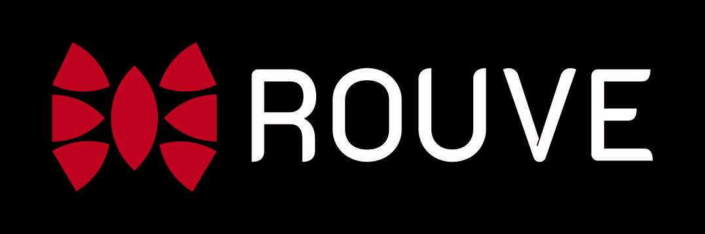

  

A digital company that creates unique websites and innovative solutions.

## Description:
Rouve is a multi-page website developed for a company that develops websites. It is a modern and stylish website designed to attract customers and showcase the company's skills and projects. 

The goal of Rouve is to present the company as a reliable partner in the field of web development and attract customers interested in creating high-quality online projects.

## Features:
- **Multi-page structure:** Rouve is designed with a multi-page architecture, allowing easy navigation between different sections and content.

- **Responsive design:** The website is fully responsive, ensuring a seamless browsing experience across various devices and screen sizes.

- **GSAP Animation:** The project incorporates animation using GSAP (GreenSock Animation Platform), adding dynamic and interactive elements to enhance user engagement.

- **Light and dark themes:** Rouve supports both light and dark themes, allowing users to switch between different visual styles based on their preferences.

- **Special button animation:** The website includes a button with a unique magnetic animation effect. This effect provides an interactive and visually appealing experience, available only on desktop devices.

- **Clean and modern design:** Rouve boasts a clean and modern design aesthetic, creating a visually appealing experience for visitors.

## Pages:
The Rouve website offers various pages, each of which has its own functionality. Here is a brief overview of the main pages:

- **Home:** The landing page of the website, providing an introduction to the company and its services.

- **Portfolio:** A showcase of the company's previous projects, demonstrating their expertise and capabilities.

- **About:** Getting to know the developers and the opportunity to get into the company

- **Services:** A detailed description of the web development services offered by the company.

## Light and Dark Themes:

The theme preference is stored in the browsers **'LocalStorage'**, ensuring that users chosen theme persist across sessions. This means that once a user selects either the light or dark theme, their preference will be remembered and applied whenever they visit the site.

*The light theme provides a clean and bright color palette, offering a visually pleasing experience.*

 

*The dark theme creates a sleek and modern look, providing a visually striking experience.*

## Technologies Used:
The Rouve website has been developed using the following technologies:

- **HTML5:** Markup language for structuring the web pages.

- **CSS3:** Stylesheet language for styling the website.

- **SCSS:** Syntactically Awesome Style Sheets, a CSS preprocessor that enhances the capabilities of CSS by adding variables, mixins, and more.

- **JavaScript:** Programming language used for interactivity and functionality.

- **GSAP:** A powerful JavaScript animation library for creating smooth and dynamic animations.

## Demo:
To explore the Rouve website, simply visit https://geletsky.github.io/Rouve/ in your web browser.

## Author
Rouve was developed: https://github.com/Geletsky

